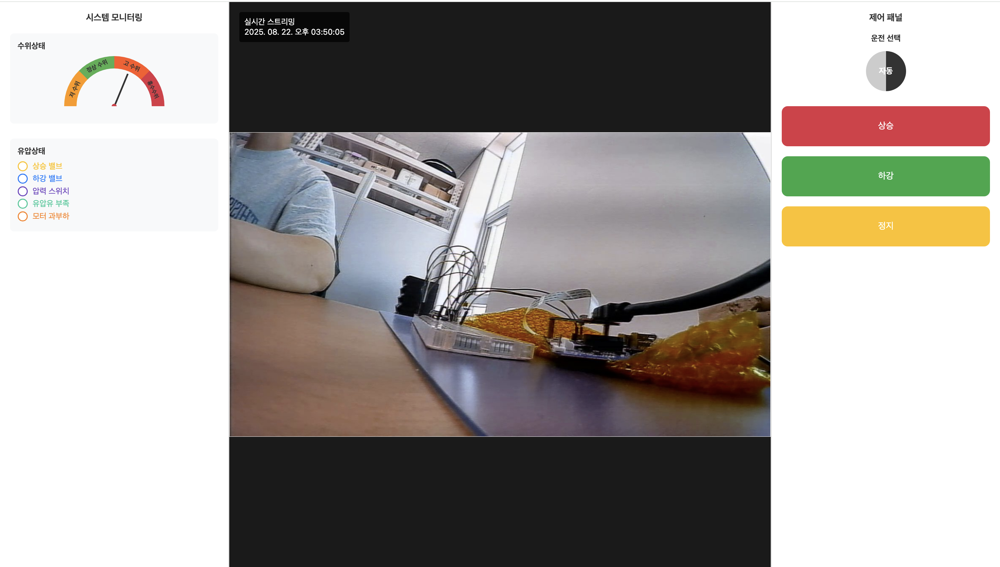

# 🐟 Fishway Remote Monitoring Demo System

이 프로젝트는 **어도(魚道) 시스템 원격 관제**를 본격적으로 구현하기 전, **데모용으로 제작한 임베디드 시스템 기반 프로젝트**입니다.  
실제 시스템에서는 **PLC**가 사용되지만, 본 데모에서는 **Arduino**가 PLC 역할을 대신하며, 영상 신호는 **AHD 카메라 → Raspberry Pi → RTSP** 방식으로 스트리밍됩니다.

---

## 📷 System Overview

구성 요소는 크게 세 가지입니다.

1. **Raspberry Pi (임베디드 시스템)**
   - AHD 카메라 입력 처리
   - RTSP 스트리밍 서버
   - MQTT 메시지 수신 및 웹 연동

2. **AHD Camera (mhd700)**
   - 차량용 후방 카메라
   - 최대 720p 지원
   - Raspberry Pi에 `AHD → HDMI → CSI` 컨버터(칩셋: `tc358743`)를 통해 연결

3. **Arduino (PLC 역할)**
   - LED 제어 (상승/하강/정지 상태 표시)
   - 스위치 입력 감지 (압력/유압/모터 상태)
   - UART3을 통해 Raspberry Pi와 시리얼 통신
   - 전압 차이를 고려하여 레벨 변환 회로 필요

---

## 🛠️ Raspberry Pi Setup

### 1. 카메라 설정

`/boot/firmware/config.txt` 수정:

```bash
dtoverlay=tc358743,cam0
camera_auto_detect=0
```

부팅 후 `/dev/video0` 장치로 인식됩니다. 현재 카메라 입력 해상도 확인:

```bash
v4l2-ctl --set-dv-bt-timings query
```

### 2. Loopback 디바이스 생성

```bash
sudo modprobe v4l2loopback video_nr=1 card_label="Loop" exclusive_caps=1
```

→ `/dev/video1` 생성

### 3. FFmpeg 인코딩 (H.264 하드웨어 가속)

```bash
ffmpeg -f v4l2 -input_format uyvy422 -video_size 1280x720 -framerate 60 \
-i /dev/video0 -c:v h264_v4l2m2m -b:v 5M -g 120 -f v4l2 /dev/video1
```

### 4. RTSP 서버 실행

```bash
v4l2rtspserver -Q 2 -F 60 -c /dev/video1
```

→ RTSP URL: `rtsp://<raspberrypi-ip>:8554/unicast`

---

## 🔌 Arduino ↔ Raspberry Pi 연결

### Raspberry Pi CM4 IO Board의 UART3 핀맵
- **TX (GPIO 4, Pin 7)**
- **RX (GPIO 5, Pin 29)**

Arduino ↔ Raspberry Pi 연결 시 전압 차이(Arduino 5V vs Pi 3.3V)를 고려하여 **저항 분압 회로** 또는 **레벨 시프터** 필요.

### 동작
- 웹페이지 버튼 입력 → MQTT 메시지 발행
- `subscriber.py` (Raspberry Pi) → MQTT 구독 후 Arduino 제어
- Arduino LED 상태 변경
  - 상승 버튼: 🔴 빨강 LED ON
  - 하강 버튼: 🟢 초록 LED ON
  - 정지 버튼: 모든 LED OFF
- 스위치 입력 → 상태 정보 MQTT 발행 → 웹에 실시간 반영

---

## 🌐 Web Interface


- **Flask (app.py)** 기반 웹 서버
- `/templates/index.html` : UI 템플릿
- `/static/css/style.css` : 스타일시트
- `/static/js/socket.js` : 웹소켓 통신
- 실시간 카메라 RTSP 스트림 + 상태 제어/표시 제공

---

## 📂 Project Structure

```
📦fishway
 ┣ 📂fishway_plc
 ┃ ┗ 📜fishway_plc.ino       # 아두이노 코드 (PLC 역할)
 ┣ 📂static
 ┃ ┣ 📂css
 ┃ ┃ ┗ 📜style.css
 ┃ ┗ 📂js
 ┃ ┃ ┗ 📜socket.js
 ┣ 📂templates
 ┃ ┗ 📜index.html            # 웹 UI 템플릿
 ┣ 📜README.md
 ┣ 📜app.py                  # Flask 웹 서버
 ┣ 📜camera.py               # 카메라 처리 코드
 ┗ 📜subscriber.py           # MQTT 구독 & 장치 제어
```

---

## ⚡ Tech Stack

- **임베디드**: Raspberry Pi CM4, Arduino
- **영상 처리**: FFmpeg, v4l2loopback, v4l2rtspserver
- **통신**: MQTT (paho-mqtt)
- **웹 프레임워크**: Flask
- **프론트엔드**: HTML, CSS, JavaScript (WebSocket)
